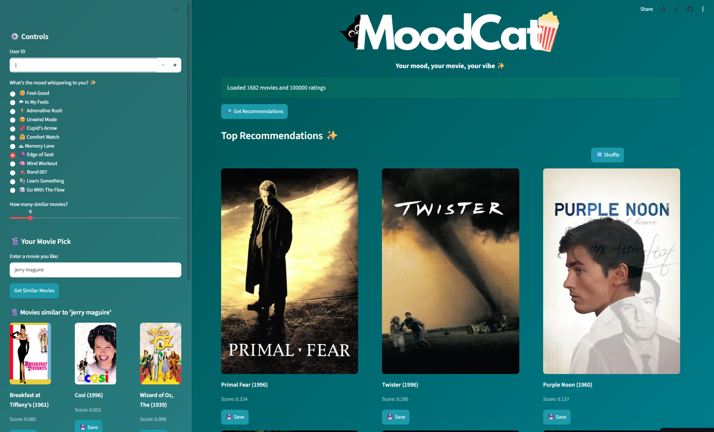
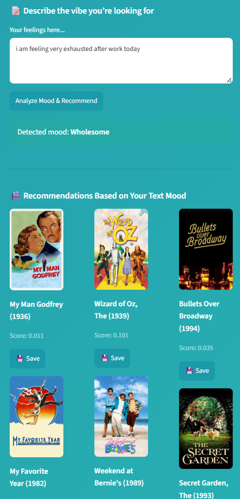

# 🌟 MoodCat — Emotion & Intent-Aware Hybrid Movie Recommendation System

MoodCat is a **hybrid movie recommendation system** that combines **collaborative filtering, content-based filtering, popularity ranking, and emotion-aware recommendation logic** to provide personalized movie suggestions based on both **user preferences** and **current emotional context**.

Instead of asking:
“What have you watched?”
MoodCat asks:
“How are you feeling right now?”





---

## 🚀 Live Demo

👉 https://moodcat-v1.streamlit.app

---

## 🎯 Problem Statement

Most recommendation systems answer one question:

> **"What has this user liked before?"**

However, movie choices are often depend on a person's **current mood**, not just their historical preferences.

Someone who usually watches thrillers may instead want a comforting comedy after a stressful day.

MoodCat explores how classical recommendation techniques can be enhanced with an emotion-aware recommendation layer without relying on large language models or deep learning.

---

## ✨ Features

* 🎭 Mood-aware movie recommendations
* 💬 Free-text emotion detection
* 🤖 Hybrid recommendation engine
* 👥 Simulated multi-user recommendations
* 🎬 Seed movie recommendations
* 🔍 Fuzzy movie title matching
* 🎲 Surprise Me mode
* 💾 Session-based watchlist
* 🖼 Dynamic movie posters using TMDB (with OMDb fallback)
* 🎨 Interactive Streamlit interface

---

## 🏗 System Architecture

```User Input
(Mood / Text / Seed Movie)

        │
        ├─────────────┐
        │             │
        ▼             ▼

Mood Selection   Intent Detection

        │             │
        ▼             ▼

 Mood Mapping    Mood Mapping

        └──────┬──────┘
               ▼

     Hybrid Recommendation Engine

               │
               ▼

      Ranked Recommendations---

## 🧠 Recommendation Pipeline

### **1. Collaborative Filtering** 


MovieLens ratings are transformed into a **user-item interaction matrix**.

A **Truncated Singular Value Decomposition (SVD)** model learns latent representations of users and movies, enabling personalized recommendations based on historical user behavior.

---

### **2. Content-Based Filtering**

Each movie is represented using its:

* Movie title
* Genre information

These features are converted into **TF-IDF vectors**, and **cosine similarity** is used to identify movies similar to a selected seed movie.

---

### **3. Mood & Intent Layer**

Users can either:

* Select a predefined mood
* Describe how they feel using natural language

Example:

```text
"I'm exhausted after exams."

↓

Intent Detection

↓

Burnout

↓

Wholesome Mood

↓

Comedy + Animation + Family recommendations
```

The intent detection module combines:

* Rule-based keyword matching
* Emoji preprocessing
* Handcrafted intent-to-mood mapping

to align recommendations with the user's emotional state.

---

### **4. Popularity Ranking**

Movie popularity is estimated using the number of user ratings.

Popularity scores are normalized using **MinMax Scaling** before being combined with the remaining recommendation signals.

---

### **5. Hybrid Scoring**

The collaborative filtering and popularity scores are normalized before being combined with the content similarity score using weighted aggregation

```text
Final Score =
0.50 × Collaborative Score
+ 0.30 × Content Similarity
+ 0.20 × Popularity Score
```

To improve recommendation diversity, the application samples recommendations from the **highest-ranked candidate pool** instead of always returning the exact same movies.

---

## 📊 **Dataset**

*MovieLens 100K*

*  1,682 movies
*  943 users
*  100,000 ratings
*  19 movie genres

Files used:

* `u.data`
* `u.item`

---

## 🛠 Tech Stack

### Machine Learning

* Scikit-learn
* Truncated SVD
* TF-IDF Vectorization
* Cosine Similarity

### Data Processing

* Pandas
* NumPy

### NLP

* Rule-based Intent Detection
* Emoji Preprocessing
* RapidFuzz Fuzzy Matching

### Frontend

* Streamlit

### APIs

* TMDB API
* OMDb API

---

## 📁 Project Structure

```text
MoodCat/
│
├── app.py
├── requirements.txt
├── README.md
├── .gitignore
│
├── assets/
│   └── MoodCat.png
│
├── ml_dataset/
│   ├── u.item
│   └── u.data
│
└── .streamlit/
    └── secrets.toml
```

---

## 🔐 Environment Variables

Store your API keys using Streamlit Secrets.

```toml
# .streamlit/secrets.toml

TMDB_API_KEY = "your_tmdb_api_key"
OMDB_API_KEY = "your_omdb_api_key"
```

---

## ▶️ Run Locally

```bash
git clone https://github.com/your-username/moodcat-v1.git
cd moodcat-v1
pip install -r requirements.txt
streamlit run app.py
```

---

## 🎬 **Additional Features**

### 🎥 Seed Movie Recommendations

Uses **RapidFuzz** to identify approximate movie titles and retrieves similar movies using **TF-IDF cosine similarity**.

### 👥 User Simulation

Switch between MovieLens user IDs to observe how collaborative filtering produces personalized recommendations for different users.

### 🎲 Surprise Me

Generates a random recommendation that still aligns with the user's selected mood.

### 💾 Watchlist

Save recommended movies during a session using **Streamlit Session State**.

### 🖼 Dynamic Poster Retrieval

Movie posters are fetched from **TMDB**, with **OMDb** serving as a fallback when necessary. Poster URLs are cached to improve performance and reduce API calls.

---

## ⚠️ Current Limitations

* Rule-based intent detection cannot fully understand complex language.
* Mood mapping is manually designed.
* User profiles are session-based and not persistent.
* Content similarity is based on titles and genres rather than plot summaries.
* Cold-start remains a challenge for unseen users.

---

## 🔮 Future Improvements

* Transformer-based sentiment classification
* Explainable recommendation system
* Adaptive hybrid weight learning
* Persistent user profiles and watch history
* Multi-emotion recommendations
* Expansion to music, anime, and books

---

## 👩‍💻 Author

**Dhyana Joshi**

B.Tech — Computer Science & Design

G H Patel College of Engineering & Technology
